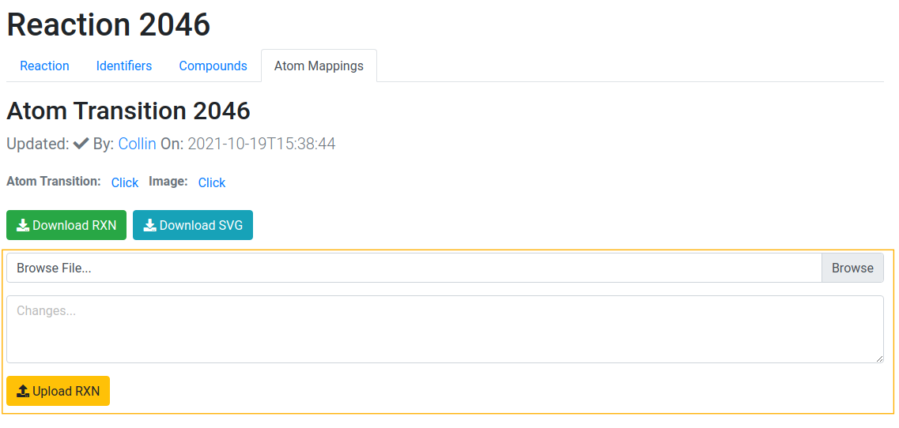

import OrcidSvg from "./assets/img/ORCIDiD_iconvector.svg";

# User Management

MetAMDB user management for the curation and review of atom mappings.

## Login/Registration

User registration is enabled by [ORCID <OrcidSvg style={{width: "3%"}}/>](https://orcid.org) to skip the creation of a separate MetAMDB account and additionally reduce spam accounts.

After successfully login in with your ORCID <OrcidSvg style={{width: "3%"}}/> you are redirected to your profile page and can start [curating](/docs/user-management#curation) atom mappings. You are logged out automatically after 24 hours or manually from your profile.

## Curation

Logged in users can see a curation field (orange) in the [Atom Mappings](/docs/reaction#atom-mappings) tab of each reaction.

To curate a reaction, upload your curated [RXN File](/docs/rxn-file) in the "Browse File" field and describe any changes you performed in the "Changes" textarea.
